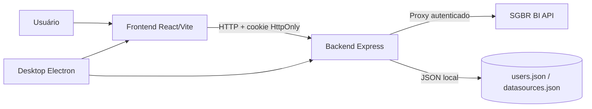
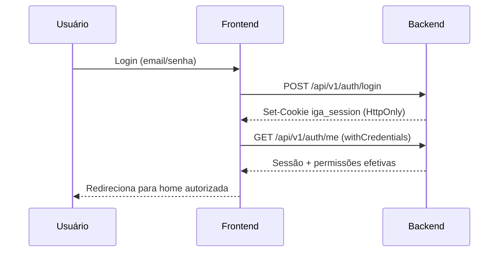
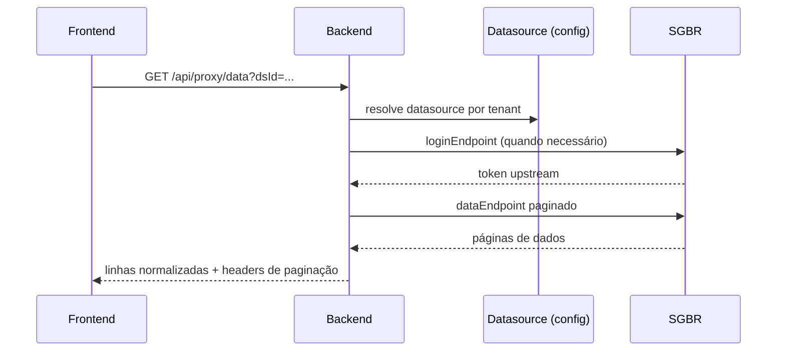

# Arquitetura do Sistema

## Componentes principais

```mermaid
flowchart LR
  user[Usuário] --> fe[Frontend React/Vite]
  fe -->|HTTP + cookie HttpOnly| be[Backend Express]
  be -->|Proxy autenticado| sgbr[SGBR BI API]
  be -->|JSON local| data[(users.json / datasources.json)]
  desktop[Desktop Electron] --> fe
  desktop --> be
```

## Fluxo de autenticação

```mermaid
sequenceDiagram
  participant U as Usuário
  participant FE as Frontend
  participant BE as Backend
  U->>FE: Login (email/senha)
  FE->>BE: POST /api/v1/auth/login
  BE-->>FE: Set-Cookie iga_session (HttpOnly)
  FE->>BE: GET /api/v1/auth/me (withCredentials)
  BE-->>FE: Sessão + permissões efetivas
  FE-->>U: Redireciona para home autorizada
```

## Fluxo de dados analíticos

```mermaid
sequenceDiagram
  participant FE as Frontend
  participant BE as Backend
  participant DS as Datasource (config)
  participant SG as SGBR
  FE->>BE: GET /api/proxy/data?dsId=...
  BE->>DS: resolve datasource por tenant
  BE->>SG: loginEndpoint (quando necessário)
  SG-->>BE: token upstream
  BE->>SG: dataEndpoint paginado
  SG-->>BE: páginas de dados
  BE-->>FE: linhas normalizadas + headers de paginação
```
